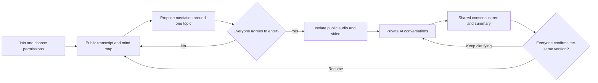

# Conflict Mitigator

**See the disagreement. Understand each other. Move forward together.**

*Live meeting · Shared mind map · Private mediation*

Conflict Mitigator is an AI-assisted collaboration platform that connects **live meetings, shared mind maps, and private mediation** in one continuous conversation flow. It helps teams see where disagreement is concentrated, understand what each person cares about, and find a path forward when discussion stalls.

[Watch the demo](https://youtu.be/rfDvkXyBtYU) · [View the pitch deck](https://docs.google.com/presentation/d/1PluOAEnYJG7kB_uygz9-uQFo8DtgF0hUg4S-WyUy70M/edit) · [Try the local demo](#try-the-local-demo) · [Run a live meeting](#run-a-live-meeting)

## The meeting keeps moving, but the decision does not

The same positions repeat. Motives are misread. Tension around one issue spreads across the entire meeting. Even with a complete transcript, a team may finish without a shared understanding of the problem.

Conflict Mitigator starts from a simple idea: **collaboration is both logical and emotional**. Topics, reasons, and possible solutions need structure. Concerns and misunderstandings need room to surface. The shared mind map gives the team a common model of the discussion, while private AI conversations give each participant space to reflect and clarify.

The product is designed for product reviews, technical debates, retrospectives, and collaborative decision-making—anywhere a team needs a shorter path from circular discussion to an actionable decision.

## A four-stage loop that helps discussion move again

### 01 · Live Meeting — Turn conversation into a map

Participants talk as usual. Within the permissions they choose, Conflict Mitigator receives finalized transcripts and organizes the conversation into evolving topics, summaries, and viewpoints. The shared mind map makes it easier to see what the team is discussing and how the issues relate.

### 02 · Hot Node — Locate the disagreement

When transcript evidence and topic analysis indicate sustained contention around a specific node, the system proposes mediation around that issue. The team can see exactly where the discussion is stuck, and every participant in the session decides whether to enter mediation.

### 03 · Private Mediation — Give everyone space to clarify

After everyone agrees and public media has been isolated, each participant speaks privately with their own AI mediator. The conversation helps surface positions, reasons, underlying concerns, and acceptable compromises. Raw private messages remain private; only consented structured insights contribute to the shared consensus tree.

### 04 · Return — Resume with shared understanding

Participants review a shared summary and choose when they are ready to return. The public meeting resumes only after everyone accepts the same summary version. If the summary changes, participants confirm again so the conversation restarts from a common foundation.

**Human-to-human conversation remains the default.** AI support stays focused on the topic that needs help, while participants control whether mediation begins and when the meeting resumes. In the current implementation, a mediation proposal includes every active participant in the room.

## Core experience

| Capability | How it helps |
| --- | --- |
| **Live group meetings** | Create or join a room, choose analysis permissions before entry, and enable the microphone or camera when needed. |
| **Chinese and English transcription** | Display finalized public speech transcripts in Mandarin Chinese or US English. |
| **Interactive discussion map** | Organize public speech into topics, summaries, and viewpoints; inspect individual nodes and group related topics. |
| **Contention detection and mediation proposals** | Use transcript evidence and topic analysis to propose focused mediation that participants can accept or decline. |
| **Private one-to-one AI mediation** | Give every participant an independent space to clarify positions, reasons, concerns, and acceptable compromises. |
| **Consensus-based return** | Align around a shared consensus tree and summary, then resume only after everyone confirms the same version. |
| **Personal affect feedback** | With separate consent, show visual and vocal affect estimates privately to the participant who produced them. |

### Interaction flow



Affect scores alone never trigger mediation. A proposal requires supporting public transcript evidence and topic analysis.

## Sharing stays under your control

- **Devices start off.** Joining a room does not enable the camera or microphone, and it does not imply consent to analysis.
- **Each purpose has separate consent.** Transcription, visual analysis, voice analysis, and structured sharing from private mediation are controlled independently and can be changed during a meeting.
- **Private chat stays separate from public content.** Raw private messages never enter the public transcript or shared mind map. Only consented structured insights support shared understanding.
- **Personal affect results are not shown to other participants.** Visual and vocal estimates are displayed separately and are visible only to their owner and authorized backend analysis. Missing or stale signals appear as unavailable.
- **Public media pauses during mediation.** Private chat opens only after public audio and video have been isolated, and media analysis remains paused throughout mediation.

The application does not store raw audio or camera images. Derived affect observations and private messages expire after 24 hours. Enabled analysis sends the relevant data to the browser speech service or configured AI providers, whose own terms govern provider-side retention. Affect feedback is a model-generated aid rather than a reading of someone's inner feelings; the VAD mapping is an experimental display only.

## Try the local demo

The demo requires **Node.js 22.18+**. From the repository root, run:

```bash
npm ci
npm run dev -- --webpack
```

Open [http://localhost:3000/room/demo](http://localhost:3000/room/demo) to explore the discussion map, transcript replay, and mediation interface. The demo uses fixtures included in the repository, so it does not require a database or AI service configuration. It demonstrates the interaction design without connecting a real multi-user meeting.

## Run a live meeting

Live meetings require PostgreSQL, Supabase anonymous authentication, LiveKit, and the relevant AI service configuration. Browser device access requires localhost or HTTPS.

<details>
<summary>Expand setup and launch instructions</summary>

### 1. Configure services

Install dependencies and copy the environment template:

```bash
cp .env.example .env.local
```

Complete the values documented in [.env.example](.env.example):

| Service | Purpose and configuration |
| --- | --- |
| Supabase and PostgreSQL | Enable Supabase anonymous sign-in and provide the public browser configuration and server credentials. `DATABASE_URL` must point to the same application database. |
| LiveKit | Provides real-time audio and video. Configure `LIVEKIT_URL`, `LIVEKIT_API_KEY`, and `LIVEKIT_API_SECRET`. |
| Meeting analysis model | Set `MEETING_MODEL_PROVIDER` to `gemini` (default) or `siliconflow`, then provide the selected provider's key and model configuration. |
| Private mediation model | Private mediation uses Gemini. Gemini configuration is still required when SiliconFlow handles meeting analysis. |
| Face++ and Hume | Provide optional visual and voice affect analysis, respectively. |
| Internal service communication | Configure `WORKER_SERVICE_TOKEN` and `INFERENCE_SERVICE_TOKEN`. `APP_ORIGIN` points to the web application; `INFERENCE_ORIGIN` may use the same origin by default. |

Keep all secrets on the server and never commit `.env.local`. Only the `NEXT_PUBLIC_SUPABASE_*` values belong in the browser bundle.

### 2. Initialize the database

Follow the [database guide](lib/db/README.md) and apply migrations `001`, `002`, and `003` in order. The application does not run migrations automatically. Back up an existing database and verify its migration history before applying changes.

### 3. Start the web app and worker

Run the following commands in separate terminals:

```bash
# Terminal 1: pages and business APIs
npm run dev -- --webpack
```

```bash
# Terminal 2: persistent media processing and meeting analysis
npm run worker:check
npm run worker
```

Open [http://localhost:3000](http://localhost:3000), create a meeting, and invite other participants. The web application and worker must share the same database, LiveKit configuration, and internal service tokens.

The worker handles media subscriptions, transcript ingestion, meeting and affect analysis, media isolation, and expiry cleanup. It must run as a persistent process. `worker:check` validates configuration and native module loading, but it does not connect to the database or verify provider credentials. In production, run both the web application and worker under process management and configure the LiveKit webhook at `/api/webhooks/livekit`.

</details>

### Current limitations

- **Transcription compatibility:** The current conservative support target is desktop Chrome/Chromium 135+ on Windows, macOS, and Linux with default feature settings. Unsupported browsers report transcription as unavailable.
- **Transcription languages:** The **Transcription language** control supports `zh-CN` and `en-US` and defaults to the browser language. Changing it restarts recognition, so finish speaking and pause first. Only finalized utterances appear in the public transcript.
- **Generated content:** AI-generated topic labels and summaries are currently in English.
- **Service availability:** Missing or failed providers appear as unavailable. The application does not silently switch providers, and Gemini validates the configured model on its first request.
- **Validation scope:** The repository includes demo flows and automated tests. Simulated tests do not constitute end-to-end validation of real providers, multi-user media, or a production deployment.

## Technology

| Layer | Technology |
| --- | --- |
| UI and interaction | Next.js 16, React 19, TypeScript, Tailwind CSS 4 |
| Discussion map | React Flow (`@xyflow/react`) |
| Media and transcript transport | LiveKit, WebRTC, browser Web Speech |
| Identity, data, and state notifications | Supabase Auth, PostgreSQL, Supabase Realtime |
| AI analysis | Google Gemini, SiliconFlow, Face++, Hume |
| Background processing | Persistent Node.js worker |

## Developer documentation

- [Frontend business API](docs/api/frontend-api.md), [internal and media API](docs/api/internal-api.md), and [interaction flows](docs/api/interact-api.md) define the interfaces and business behavior.
- [v0.2 decision overrides](docs/api/decision-overrides-v0.2.md) and the [v0.3 multimodal contract](docs/api/multimodal-v0.3.md) describe current implementation overrides. Where they conflict, v0.3 takes precedence.
- The [database and migration guide](lib/db/README.md) covers initialization, migrations, and data-access boundaries.
- The [HTTP test guide](tests/http/README.md) and [browser acceptance guide](tests/browser/README.md) describe validation scope and workflows.

The main implementation lives in `app/`, `components/`, and `hooks/` for the UI; `contracts/`, `services/`, and `lib/db/` for business and data logic; and `lib/integrations/` and `worker/` for external services and background processing.

Common validation commands:

```bash
npm run lint
npm run typecheck
npm run test:media
npm run test:worker
npm run test:server
npm run test:http
npm run build -- --webpack
```

Database-dependent tests should use a dedicated test database with all migrations applied. Some tests are skipped when the required database configuration is absent.
